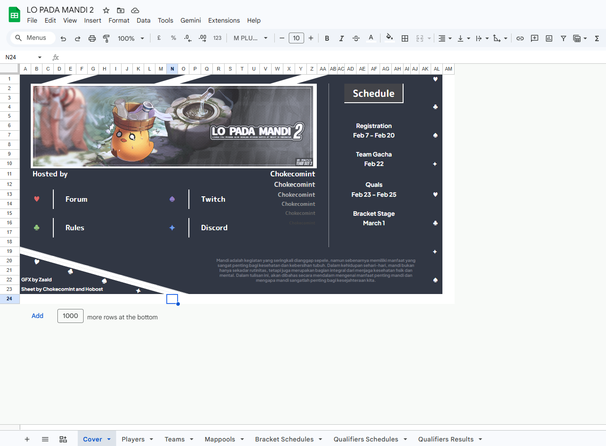
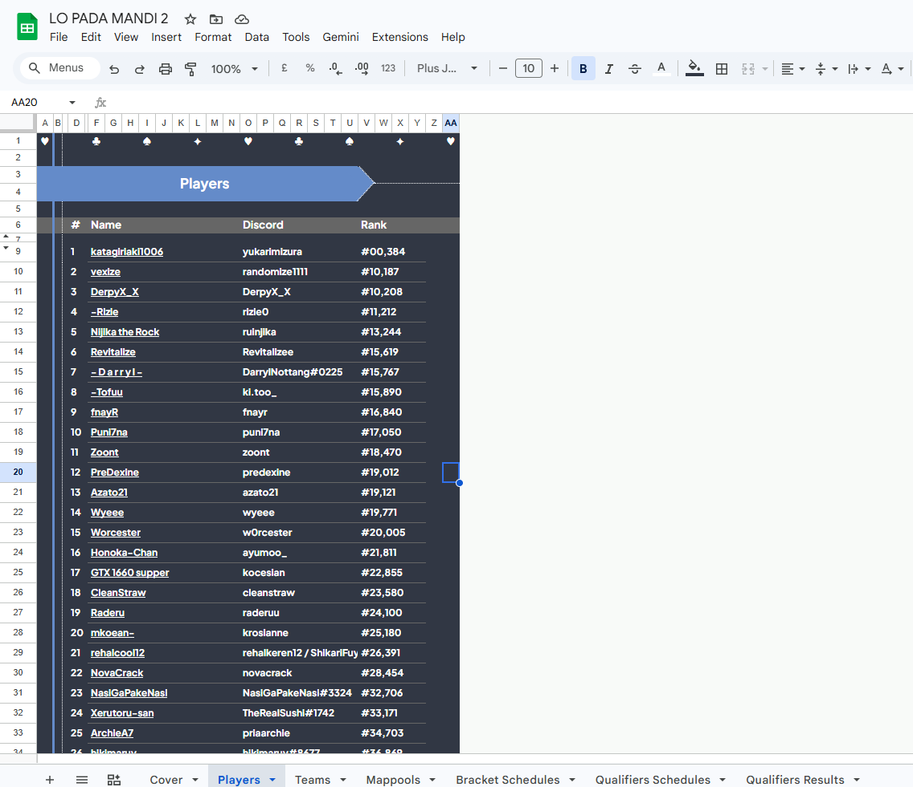
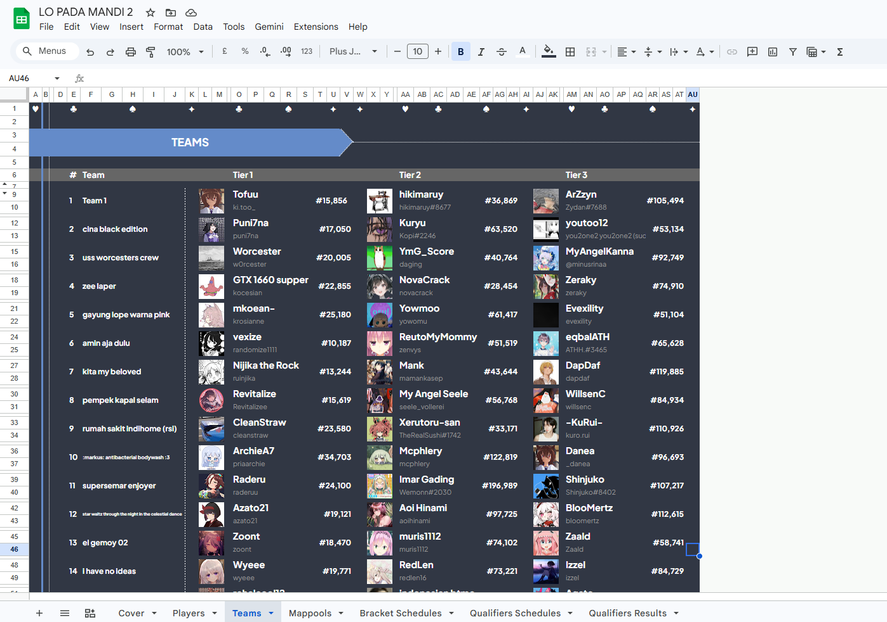
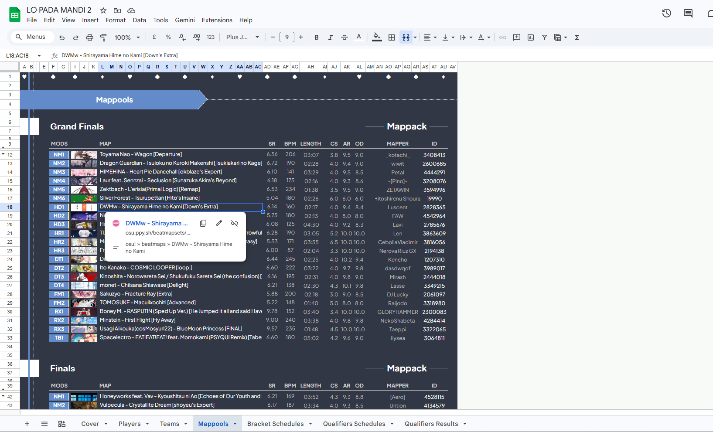

# 📊 William Adriel| Senior Business Intelligence Manager
**Data Strategy | Growth Analytics | Fintech & FMCG Specialist**

Currently driving data-led decision-making at **MoneeInsure** in Jakarta. I specialize in building robust data architectures that bridge the gap between complex engineering (PostgreSQL/Python) and high-level business strategy.

[LinkedIn](https://www.linkedin.com/in/william-adriel/) | [Upwork](https://www.upwork.com/freelancers/~01a6a0d53b5e656ff2?mp_source=share) | [Portfolio Site](YOUR_LINK)

---

## 🛠️ Technical Stack
- **Languages:** SQL (PostgreSQL, MySQL, SparkSQL, PrestoSQL), Python (Pandas, NumPy, PySpark)
- **BI & Viz:** PowerBI, Metabase, Microstrategy, Redash, Tableau
- **Tools:**  DBEAVER (Database Management and Data processing), AWS (Solution Architect Associate), Google Sheets/Excel (Advanced), KNIME
- **Domain Expertise:** Insurance (Life/General), Automotive (Growth), FMCG (Overseas SFA), Agritech (Geo-spatial)

---

## 🚀 Key Impact Projects
*Click on the sections below to view details and technical impact.*

 

<b>📊 GWP, Policies, and Company Achievements Main Monitoring Dashboards </b>

**Role:** Lead the creation for GWP, Policies and Company Achievements monitoring dashboard
- **The Work:** Managed full-cycle data support for MoneeInsure. Built real-time monitoring for Company Achievements, GWP and Policies.
- **Outcome:** Clear and concise reporting pipelines for the main company monitoring dashboards (Helicpoter and detail view of all the teams and company achievements). Resulting in a more sophisticated actionable insights taken

<b>🏆 GIIAS 2025: End-to-End Data Leadership</b>

**Role:** Data Team Lead for Astra Financial GIIAS Flash Deal Event and Sales Monitoring
- **The Work:** Managed full-cycle data support for GIIAS (Jakarta, Surabaya, Semarang, Bandung). Built real-time monitoring for Sales, Ushers, and Booth performance.
- **Outcome:** Provided the "Flash Deal" event with instant insights, leading to optimized lead generation and achievement monitoring across the events in 4 major cities.

<b>🧬 Growth Database & Migration (MoXa)</b>

- **The Work:** Led the restructuring of the MoXa Growth Database. Migrated and integrated legacy data from FIF, AID, and CMS into a unified source of truth.
- **Outcome:** Streamlined customer segmentation and product monitoring, enabling more accurate quarterly corporate reviews.

<b>🌍 Overseas Sales Force Automation (Wingsfood)</b>

- **The Work:** Coordinated SFA implementation across 5+ countries. Developed supply chain dashboards tracking the "Order-to-Invoice" journey.
- **Outcome:** **50% revenue increase** within 3 months of deployment by implementing KPI trackers for international sales teams.

---

## 💼 Professional Experience

### **Senior Business Intelligence** | MoneeInsure 
*Jakarta | 8 Months - Present*
- **GWP Portfolio & Loss Ratio:** Developing performance tracking for Ecosystem vs. Non-Ecosystem business lines and monitoring Product Loss Ratios.
- **Automation:** Built reporting pipelines for Customer Service and Claim Monitoring to reduce manual workload.
- **Governance:** Leading Weekly/Monthly PDCA (Plan-Do-Check-Act) and Actuary reporting for both General and Life Insurance.

### **Growth Data Analyst** | Astra Financial (MoXa)
*2 Years 3 Months*
- **Direct Revenue Impact:** Validated the MoXa x Bank Jasa Jakarta collaboration, generating **>300M in sales revenue** in Dec 2023.
- **Customer Acquisition:** Successfully converted 1,000+ leads into transacting customers, generating **>100M GMV**.
- **Strategic Insight:** Provided targeted data for quarterly corporate reviews and growth department PDCA.

### **Business Intelligence Analyst** | Wingsfood (PT Sayap Mas Utama)
*2 Years 4 Months*
- **Supply team Strategic Insight:** Optimized logistics efficiency by creating manpower planning models and container allocation trackers.
- **ETL and Data Cleansing:** Reduced query latency by implementing advanced SQL tuning and customized functions.

### **Data Analyst Intern** | Yara International
*Singapore*
- **Geo-spatial Insights:** Built cloud data pipelines (Metabase) for geo-spatial assets.
- **Chatbot Leadership:** Led a farmer-focused chatbot project reaching **100k+ users**.

### **Advanced Tournament Management System (Osu! Rhythm Game)**
*Integrated Google Sheets Ecosystem with API & VBA Automation*
- **The Tech:** Google Sheets API, Excel VBA, UX/UI Design, JSON Data Parsing.
- **The Solution:** Developed a sophisticated automation suite for competitive match tracking.
  - **Match Automation:** Integrated live APIs to automatically fetch and validate match results.
  - **Map Selection Engine:** Built a logic-based automation tool for map pooling and selector efficiency.
  - **UI/UX Design:** Engineered a custom interface within Google Sheets to provide a professional, dashboard-like experience for tournament organizers.
- **The Impact:** Transformed a manual, error-prone coordination process into a seamless, automated digital ecosystem.

---

## 🖼️ Project Gallery (Visuals)
*A look into the Excels and Dashboards I've built.*

| Osu Game Integrated Google Sheets |
| :---: |
|  |  |  |  |  |  |  |
| *Osu Game Integrated Google Sheets* |

---

## 📜 Certifications
- **Data Analyst with PySpark** (Datacamp)
- **Certified Associate in Project Management** (PPM School of Management)
- **Data Analytics for Building Data-Driven Culture**
- **AWS Certified Solutions Architect** (Former)

---

  <i>"Passionate about turning raw data into sustainable business growth and insights."</i>

