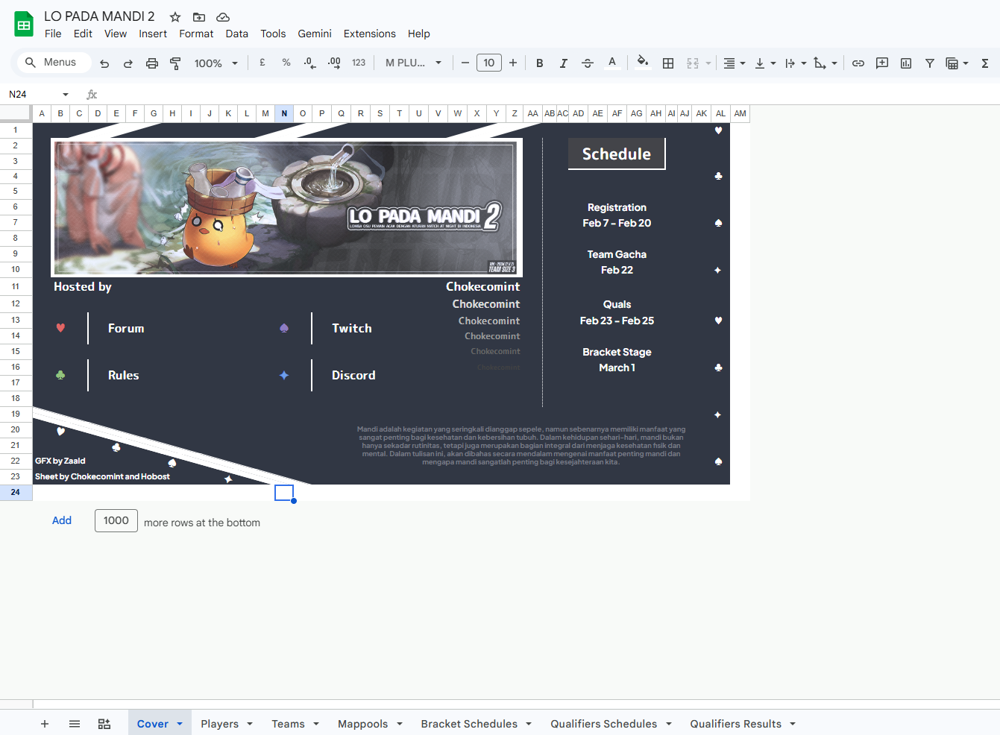
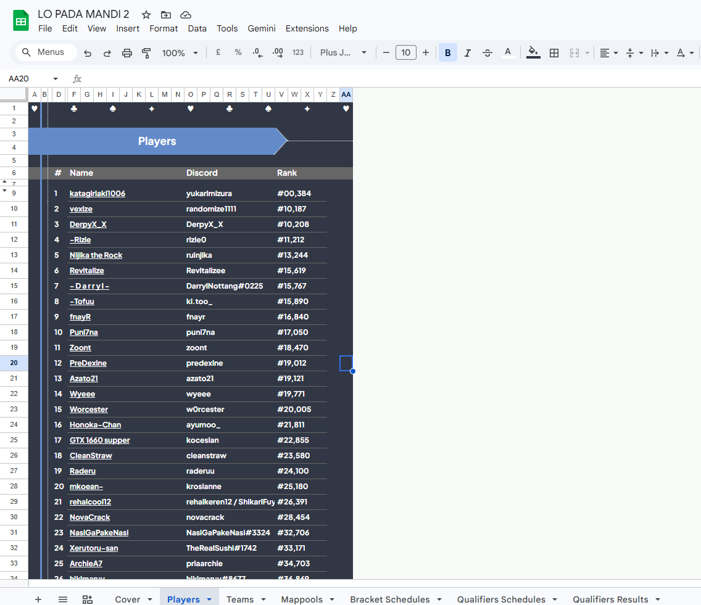
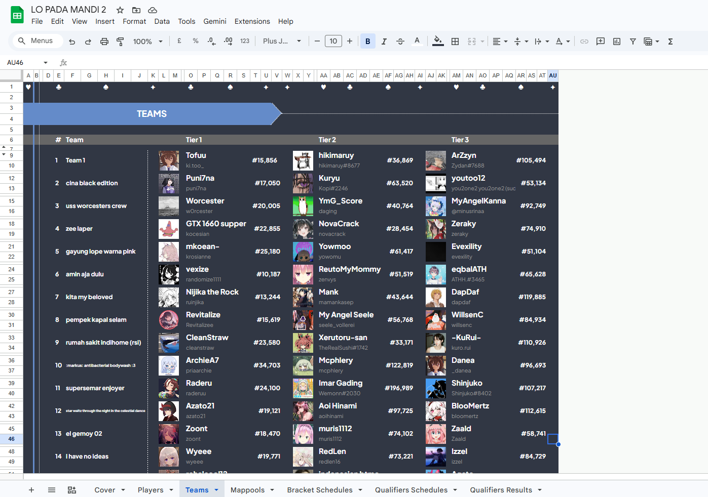
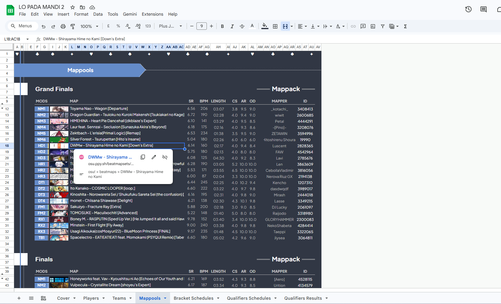

# 📊 Senior Business Intelligence Portfolio

<!-- *** HERO BANNER *** -->

  

<!-- *** CONTACT BADGE BAR *** -->

  
  
  

<!-- *** EXECUTIVE HEADER *** -->
<table border="0">
  <tr>
    <td width="30%" align="center">
      
    </td>
    <td width="70%">
      <h3>データ分析者 | Data Analyst</h3>
      
Transforming complex financial, insurance, fmcg and e-commerce data into high-level growth strategy. 
	  I specialize in building robust data architectures that bridge the gap between complex engineering and executive decision-making.

      

        
        
        
      

    </td>
  </tr>
</table>

---

## 🛠️ Technical Arsenal

| Category | Mastery & Tools |
| :--- | :--- |
| **Data Engineering** | `SQL (PostgreSQL / SparkSQL / BigQuery)` `Python (Pandas / PySpark)` `ETL` |
| **Business Intelligence** | `PowerBI` `Metabase` `Tableau` `Microstrategy` `Redash` |
| **Strategic Operations** | `Advanced Google Sheets` `VBA` `Corporate PDCA` `Project Management (CAPM)` |
| **Cloud Infrastructure** | `AWS (Solutions Architect)` `API Integration` `JSON Parsing` |

---

## 🚀 Strategic Impact Projects
*Detailed case studies of high-revenue data implementations.*

<table>
  <tr>
    <td>
      <b>📊 GWP & Company Monitoring</b> 
      <i>MoneeInsure</i> 
      

      Built unified "Helicopter View" reporting pipelines for GWP and Policy achievements, enabling real-time executive-level pivots.
    </td>
    <td>
      <b>🏆 GIIAS 2025 Data Analyst and Flash Deal Event Data Lead</b> 
      <i>Astra Financial</i> 
      

      Orchestrated end-to-end data support for Indonesia's largest automotive event. Managed real-time performance tracking across 4 major cities.
    </td>
  </tr>
  <tr>
    <td>
      <b>🧬 Growth DB Migration</b> 
      <i>MoXa (Astra Financial)</i> 
      

      Restructured and integrated FIF, AID, and CMS databases. Streamlined segmentation and enhanced corporate quarterly review accuracy.
    </td>
    <td>
      <b>🌍 Overseas SFA</b> 
      <i>PT Sayap Mas Utama (Wingsfood Indonesia)</i> 
      

      Coordinated Sales Force Automation in 5+ countries. Resulted in a <b>50% revenue increase</b> within 3 months of deployment.
    </td>
  </tr>
</table>

---

## 💼 Professional Narrative

<b>Senior Business Intelligence | MoneeInsure</b> (Current)

Leading data governance and actuary reporting for Life/General insurance. Developed performance tracking for Ecosystem vs. Non-Ecosystem business lines.

<b>Growth Data Analyst | Astra Financial</b> (2.3 Years)

Generated <b>>300M in sales revenue</b> via Bank Jasa Jakarta collaboration and converted 1,000+ leads into <b>>100M GMV</b>.

<b>Business Intelligence Analyst | Wingsfood</b> (2.4 Years)

Optimized global logistics via manpower planning models and reduced query latency through advanced SQL tuning.

---

## 🎮 Innovation Side Project
### **Tournament Management Ecosystem (Osu!)**
> **Concept:** Automated digital ecosystem for competitive rhythm gaming.  
> **Tech Stack:** Google Sheets API, VBA, JSON Data Parsing.  
> **Result:** Seamlessly automated match tracking and map selection.

### **National Rhythm Game Tournament Director**
*Osu! Indonesia Tournament*
- **Leadership:** Leading a national-scale tournament consisting of **400+ participants**.
- **Team Management:** Led a diverse team of **25+ staff members**.
- **Digital Ecosystem:** Leading **Tournament Management System** using Google Sheets API, VBA, and JSON parsing to automate match tracking and map selection.

---

## 🖼️ UI/UX Design & Dashboard Gallery
*Visualizing the UI/UX final design, resulted from automation logic built within Google Sheets.*

| | | |
| :---: | :---: | :---: |
|  |  |  |
|  |  |  |

---

## 📜 Certifications & Education
- 🏆 **Certified Associate in Project Management** | PPM School of Management
- 🐍 **Data Analyst with PySpark** | Datacamp
- ☁️ **AWS Certified Solutions Architect** (Former)
- 🎓 **Bachelor of Computer Science** | Specializing in Big Data

---

   
  <i>"Turning raw data into sustainable business growth and actionable insights."</i>

